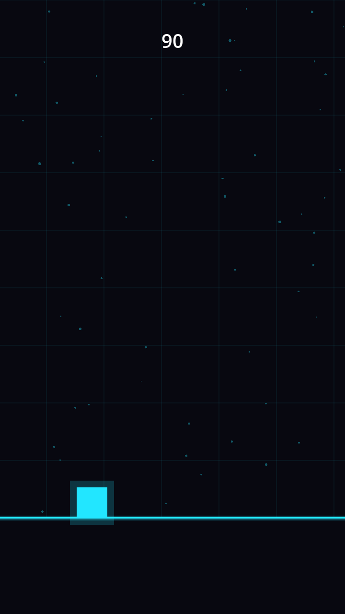
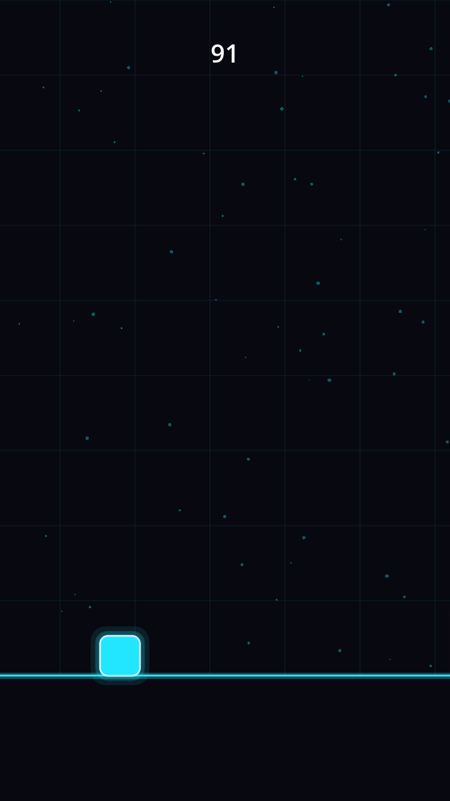

# POC run 007 — M1 `asset` skill: SVG re-skin of `runner-0002`

**Date:** 2026-05-31 · **Skill exercised:** `asset` (new) + `validator` (Method 3) · **Target:** `runner-0002` ("Neon Dash II"), the best-looking `playable` baseline.

This is the M1 proof: run the new `asset` skill end-to-end on a real title, A/B the SVG re-skin against the primitive original, and convert every felt gap into a concrete `SKILL.md` edit — the same mechanism as M0 runs 001–006, now applied to art.

## What ran

Following `.claude/skills/asset/SKILL.md`:

1. **Derived a visual system** from `concept.art_direction` *before* authoring any file (Step 0): fixed 5-colour palette, one stroke style, one form language, one shading model, one scale rule. Recorded verbatim in `manifest.asset_pass.visual_system`.
2. **Authored three SVGs** (`games/runner-0002/art/{player,obstacle,orb}.svg`), all conforming to that system.
3. **Headless import pass** — `godot --headless --path games/runner-0002/ --import` generated the `.svg.import` sidecars + textures (exit 0).
4. **Rewired the game** — `Main.gd` actors (player/obstacle/orb) became textured `Sprite2D` nodes; the matching `_draw()` primitives were removed; a new `Overlay.gd` child carries the HUD/particles/flash above the sprites. Movement, collision, spawning, scoring, input, and all juice timers are byte-for-byte unchanged.
5. **Recorded the pass** — `assets[]` flipped to `origin:"svg"` for the three re-skinned actors; `asset_pass` block populated; `validate` → OK.
6. **Re-validated (programmatic gate)** — `godot --headless --path games/runner-0002/ --quit-after 120` → exit 0, zero `SCRIPT ERROR` / `ERROR:` / "Failed to load" lines. No `selftest.gd` exists (trivial arcade loop — builder legitimately omitted one), so Method 1.5 is N/A.

## The visual system (the real deliverable)

| Axis | Decision |
|---|---|
| **Palette** | `#080810` bg · `#22e6ff` player/primary · `#ff3df0` + `#ffe14d` danger · `#ffd23d` pickup — lifted directly from `art_direction`. |
| **Stroke** | 2.5px light edge stroke on the crisp core; glow layers unstroked. |
| **Form** | Sharp-cornered geometric, rounded corners (rx 10–12), low detail. |
| **Shading** | Flat fill + stacked low-alpha glow halo (3 layers). **No SVG filters** — ThorVG (Godot's importer) has limited `feGaussianBlur` support, so the glow is executed as concentric semi-transparent shapes, matching the builder's original code glow recipe and staying deterministic. |
| **Scale** | Crisp core spans 60u of a 100u `viewBox`; each sprite is scaled `footprint / 60`, so the core matches the primitive's old footprint and the glow bleeds into the padding. |

Re-skinned: **player, obstacle, orb**. Left primitive (deliberately — motion/structure, not art): **ground, background parallax grid+stars, particles, screen-shake, crash-flash, squash/stretch**.

## A/B

| Before (primitive `_draw`) | After (SVG re-skin) |
|---|---|
|  |  |

**Read:** the after-frame reads as one coherent neon system — the player gains rounded corners, a soft layered glow, and a bright edge stroke; obstacle bars are rounded and glow in their per-instance danger colour; the ground and HUD are unchanged. It plays identically (logic untouched; headless run clean). The re-skin is legibly *more designed* than the hard-edged primitive squares, and the assets share one language rather than reading as a collage.

## Findings — each attributable to specific `asset` SKILL.md prose (the POC value)

1. **[Biggest finding — technical] The skill under-specifies the swap for immediate-mode `_draw()` games.** The builder's default output (and `runner-0002`) renders *everything* in a single root `_draw()` with screen-shake via `draw_set_transform`, and has **zero child nodes**. Honoring "world actors → `Sprite2D`" therefore forced three non-obvious moves the current prose doesn't call out: (a) keep the background layer in the root `_draw()` but move the HUD/particles/flash into a **higher-z child** (`Overlay.gd`) so z-order stays correct (a parent's own `_draw()` renders *below* its children); (b) hoist screen-shake into shared per-frame state (`current_shake`) so sprites and background shake together; (c) pool one `Sprite2D` per spawned actor. → **Edit:** add a "Re-skinning an immediate-mode `_draw()` game" subsection to the swap mechanism documenting exactly these three steps.

2. **[Tradeoff not surfaced] `draw_texture_rect()` in-place was the lighter alternative.** For this architecture, replacing each `draw_*` call with `draw_texture_rect()` *inside the existing `_draw()`* would have used the same SVG textures while avoiding all the node/z-order/shake re-plumbing in finding #1. The skill currently mandates `Sprite2D`/`TextureRect` nodes. → **Edit:** document `draw_texture*`-in-place as the preferred swap for immediate-mode games, reserving retained `Sprite2D` nodes for node-based scenes — and make the choice legible in `asset_pass.notes` rather than silent.

3. **[Form language too conservative] The player still reads as "a square, just rounder."** The upgrade is real but not *dramatic*, because the visual system's form language ("sharp-cornered geometric, low detail") permits no distinguishing silhouette detail. A single signature element per actor (a directional notch on the player, an inner facet on the orb) would make "designed" unmistakable while staying geometric. → **Edit:** Step 0 "Form language" should prompt for *one* signature detail per actor, not just global corner/detail level.

4. **[Minor] Glow falloff is slightly tighter than the primitive's additive halo.** The stacked-alpha halo reads a touch smaller/softer than the original `_draw_glow_rect` (which grew the halo ~35% of the shape size). Acceptable and arguably cleaner, but worth a one-line note in the scale rule that glow padding should roughly match the primitive's halo extent so the re-skin doesn't feel dimmer.

## Success criteria (§12)

1. ✅ `asset` ran the full re-skin with **no manual code fixes** — headless-clean on the first run.
2. ✅ Re-skinned game imports + runs headless clean; `selftest.gd` N/A (trivial arcade loop).
3. ⏳ **Owner A/B playtest pending** — the rendered before/after above strongly support "more designed + coheres + plays identically"; the human gate (validator Method 3) confirms *feel* before `styled` is stamped.
4. ⏳ Manifest carries a populated `asset_pass` + `origin:"svg"` entries and is `validate`-OK; **status advances `validated → playable → styled` once the owner confirms** (criterion 3). `validated → styled` is intentionally illegal — `playable` is the required intermediate gate.
5. ✅ Every shortfall above is legible and attributed to specific `asset`/`validator` prose, with the exact edit it implies.

## Next

- Owner does the ~60s A/B playtest. On confirmation: `node tools/manifest.mjs set-status runner-0002 playable` then `set-status runner-0002 styled`.
- Apply findings #1–#3 to `.claude/skills/asset/SKILL.md` (finding #1 is the highest-value edit — it generalizes the swap to the builder's default architecture).
